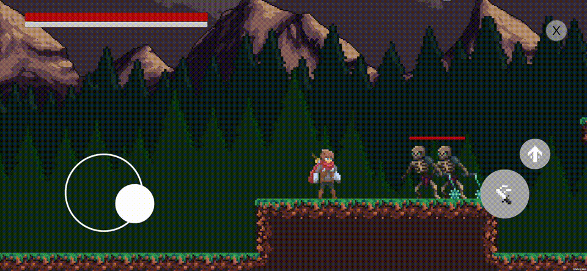
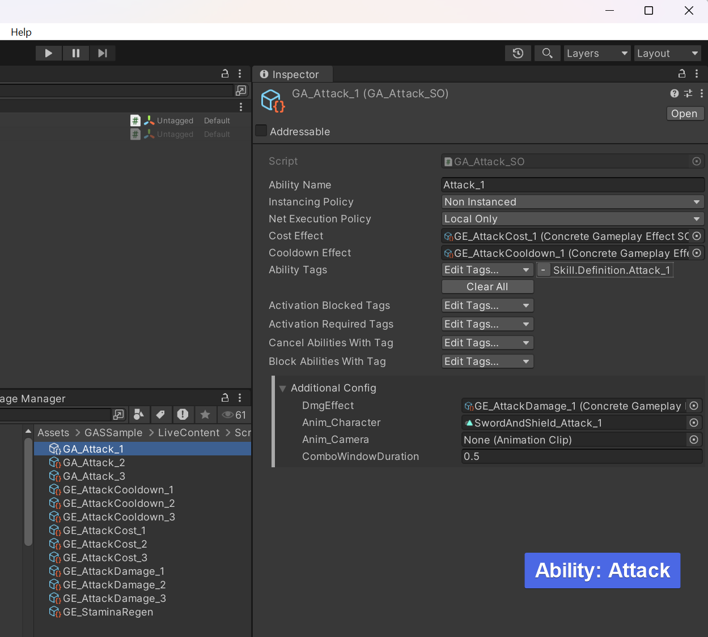
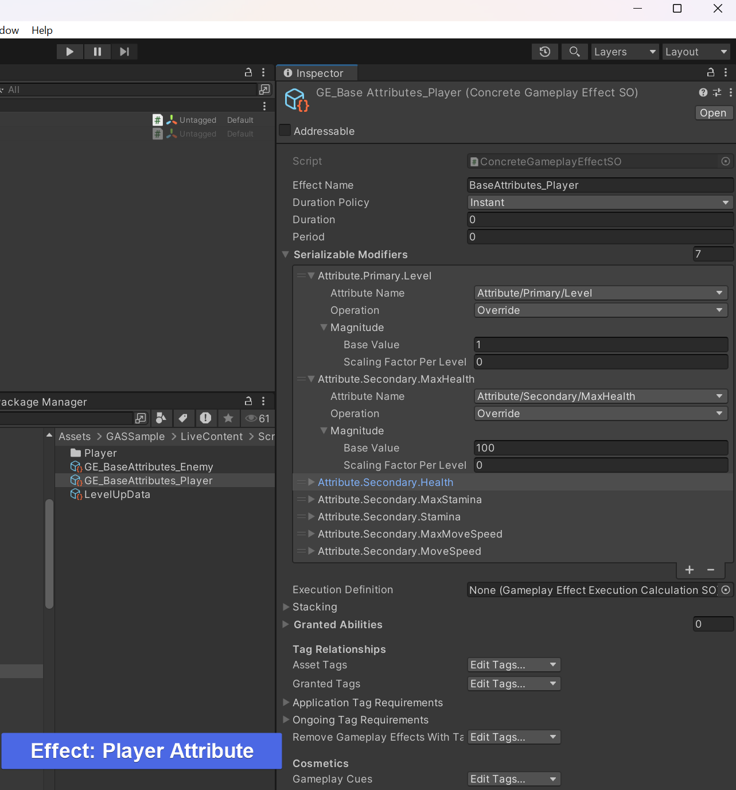
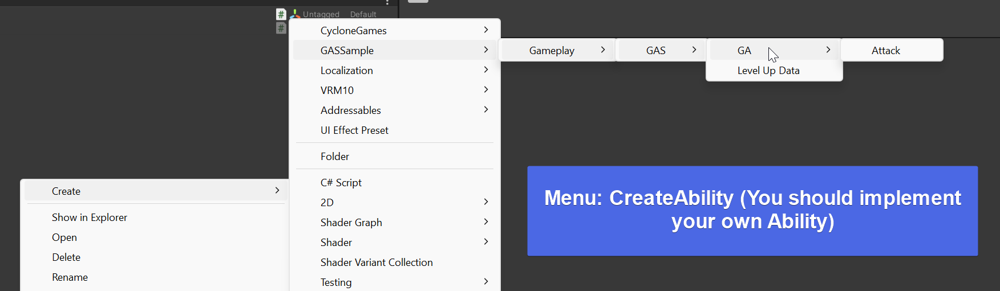
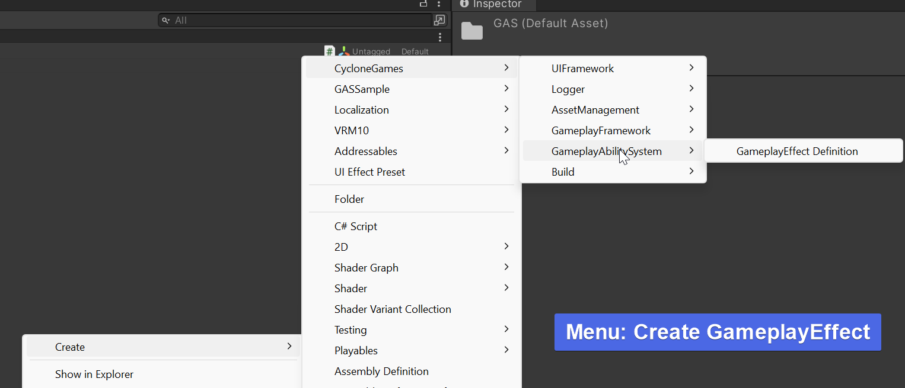

# Unity GameplayAbility Sample

<strong>English</strong> | <a href="README_CHN.md">中文</a>

---

> [!NOTE]
> **The current project is already finished refactor. The new version is based on the [new GAS system](https://github.com/MaiKuraki/UnityStarter/tree/main/UnityStarter/Assets/ThirdParty/CycloneGames/CycloneGames.GameplayAbilities). The old version branch is no longer maintained.**

> [!NOTE]
> Welcome to use the [new GAS system](https://github.com/MaiKuraki/UnityStarter/tree/main/UnityStarter/Assets/ThirdParty/CycloneGames/CycloneGames.GameplayAbilities) and the [original framework](https://github.com/MaiKuraki/UnityStarter) of this project.
> 
> The basic functions of this project are complete. Currently, only the basic functions of GAS are displayed, including a basic three-hit combo for ARPG. Although the demo code supports RootMotion, the animation resources do not include IK or RootMotion. If you have more new features，such as the application of GameplayCue to sound and paritcle, or an exp-add module, or a complete combat with AI, etc., don't hesitate to contact me in Github issues, and I will consider adding the prototype to the codebase when time permits.
>
> I will continue to develop non-open-source projects based on the [new GAS system](https://github.com/MaiKuraki/UnityStarter/tree/main/UnityStarter/Assets/ThirdParty/CycloneGames/CycloneGames.GameplayAbilities), which also means the new GAS will continue to optimize the user experience.

## About
Easily create a large number of skills by simply configuring Scriptable Objects, without complex code or tangled animation state machines! 

This project is originally based on the [UnityStarter](https://github.com/MaiKuraki/UnityStarter) framework's [VContainer](https://github.com/MaiKuraki/UnityStarter/tree/VContainerPublic) branch, showcasing the [Gameplay Ability System](https://github.com/MaiKuraki/UnityStarter/tree/main/UnityStarter/Assets/ThirdParty/CycloneGames/CycloneGames.GameplayAbilities) and [Gameplay Tags](https://github.com/MaiKuraki/UnityStarter/tree/main/UnityStarter/Assets/ThirdParty/CycloneGames/CycloneGames.GameplayTags) features, providing an ARPG demo.

## Branches
-   The old version will be saved in the `Legacy(Zenject)` branch as an archive backup, and will no longer be supported.
-   

## Unity Version Dependency

The minimum Unity version required for this project is `Unity 2022.3`. It will not run correctly on `Unity 2021` or earlier versions.

## Preview
-   New Version Preview (3D Model already in demo)
    -   
-   Old Version Preview (New GameFramework doesn't contains this)
    -   

## Configuration Preview
-   
-   
-   
-   

## Progress
- [x] Recreated the project based on [UnityStarter](https://github.com/MaiKuraki/UnityStarter)
- [x] Scene loading pipeline
- [x] Implement the Gameplay logic with the [new GAS system](https://github.com/MaiKuraki/UnityStarter/tree/main/UnityStarter/Assets/ThirdParty/CycloneGames/CycloneGames.GameplayAbilities)

## Launch Scene

Please search for the `Scene_Launch` scene within the project to start the game.
