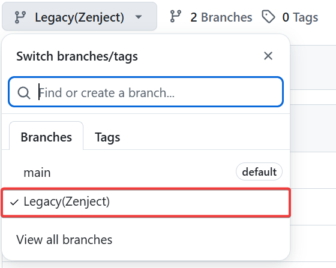
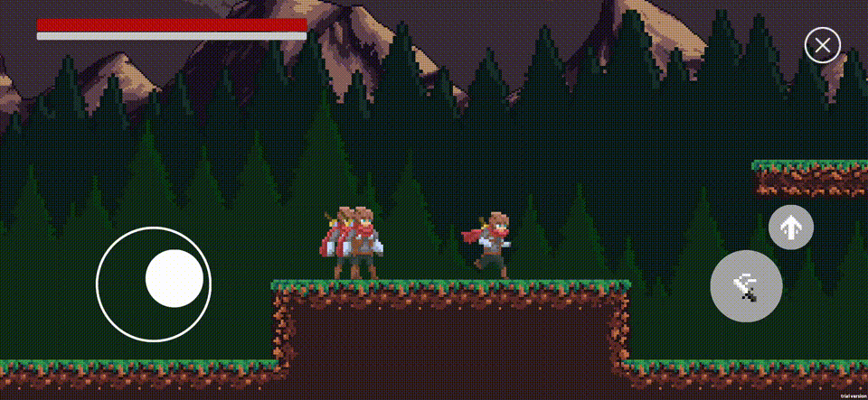

# Unity GameplayAbility Sample

<strong>English</strong> | <a href="README_CHN.md">中文</a>

---

> [!NOTE]
> **The current project is undergoing refactoring and upgrading. The new version is based on the [new GAS system](https://github.com/MaiKuraki/UnityStarter/tree/main/UnityStarter/Assets/ThirdParty/CycloneGames/CycloneGames.GameplayAbilities). The old version branch is no longer maintained.**

> [!NOTE]
> The current branch is under refactoring, and various features cannot run completely. If you urgently need to use the GAS system, please go directly to the [new GAS system](https://github.com/MaiKuraki/UnityStarter/tree/main/UnityStarter/Assets/ThirdParty/CycloneGames/CycloneGames.GameplayAbilities) and its project to view and try it out.

## About

This project is originally based on the [UnityStarter](https://github.com/MaiKuraki/UnityStarter) framework's [VContainer](https://github.com/MaiKuraki/UnityStarter/tree/VContainerPublic) branch, showcasing the [Gameplay Ability System](https://github.com/MaiKuraki/UnityStarter/tree/main/UnityStarter/Assets/ThirdParty/CycloneGames/CycloneGames.GameplayAbilities) and [Gameplay Tags](https://github.com/MaiKuraki/UnityStarter/tree/main/UnityStarter/Assets/ThirdParty/CycloneGames/CycloneGames.GameplayTags) features, providing an ARPG demo.

## Branches
-   The old version will be saved in the `Legacy(Zenject)` branch as an archive backup, and will no longer be supported.
-   

## Unity Version Dependency

The minimum Unity version required for this project is `Unity 2022.3`. It will not run correctly on `Unity 2021` or earlier versions.

## Preview
-   Old Version Preview
    -   

## WebGL Demo
-   Old Version WebGL Demo
    -   [➡️ Click here for the WebGL Demo](https://maikuraki.github.io/2024/10/07/Unity_WebGL_Demo/)

## Launch Scene

Please search for the `Scene_Launch` scene within the project to start the game.
