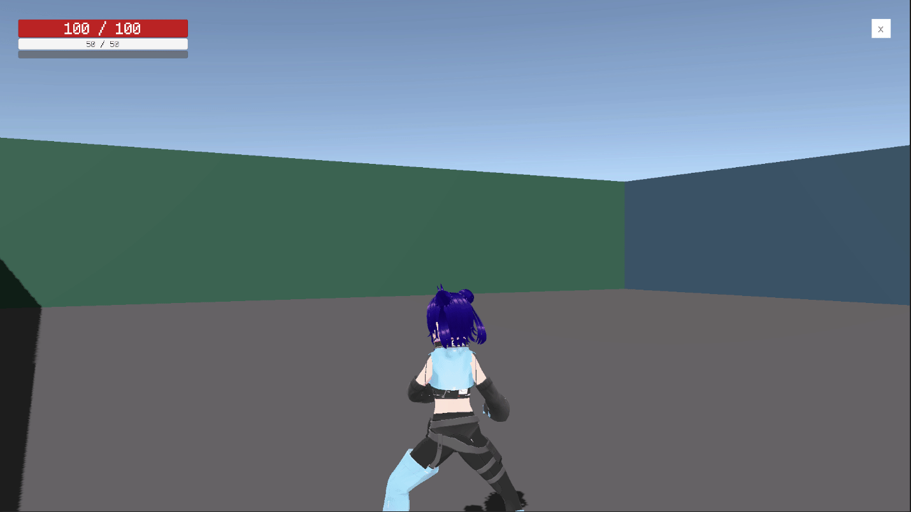
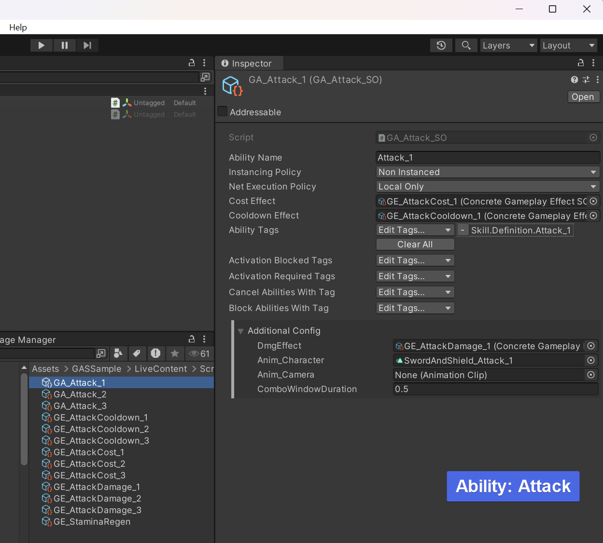
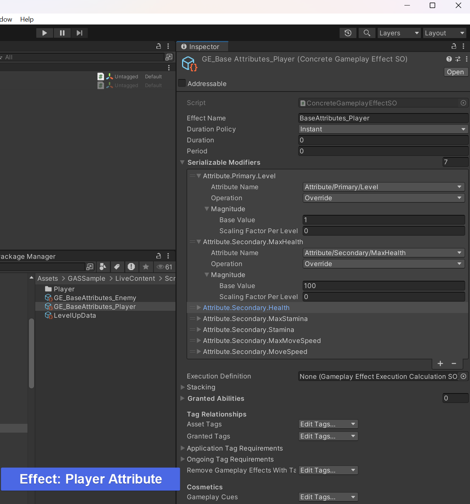
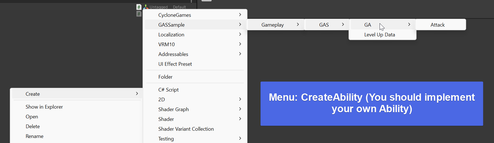

# Unity GameplayAbility Sample

<a href="README.md">English</a> | <strong>中文</strong>

---

> [!NOTE]
> **当前项目已经完成重构升级，新版本基于 [新的 GAS 系统](https://github.com/MaiKuraki/UnityStarter/tree/main/UnityStarter/Assets/ThirdParty/CycloneGames/CycloneGames.GameplayAbilities)，旧版分支不再维护。**

> [!NOTE]
> 本项目默认你已经完全了解虚幻引擎 GameplayAbilitySystem 系统或你已经不是初学者，项目的目的是为创建一套灵活且结构清晰的技能系统，项目基本功能已经开发完成，当前只展示 GAS 的基本功能，包含了一个 ARPG 的基本的三连击，虽然 Demo 代码已支持 RootMotion，但动画资源不包含 IK 以及 RootMotion。如果你有更多希望我加入的新功能，比如 GameplayCue 对声音以及例子的应用，或经验值模块，或者包含 AI 的完整战斗等等，请在 issule 中提出，我会酌情抽时间将原型加入代码库。
>
> 我会继续基于[新的 GAS 系统](https://github.com/MaiKuraki/UnityStarter/tree/main/UnityStarter/Assets/ThirdParty/CycloneGames/CycloneGames.GameplayAbilities)开发非开源的项目，也意味着新 GAS 将会继续优化使用体验。
> 
> 欢迎使用[新的 GAS 系统](https://github.com/MaiKuraki/UnityStarter/tree/main/UnityStarter/Assets/ThirdParty/CycloneGames/CycloneGames.GameplayAbilities)，以及本项目的[原始框架](https://github.com/MaiKuraki/UnityStarter)。

---

## 关于

本项目原始框架 [[UnityStarter]](https://github.com/MaiKuraki/UnityStarter) 中的 [VContainer](https://github.com/MaiKuraki/UnityStarter/tree/VContainerPublic) 分支，展示其中 [Gameplay Ability System](https://github.com/MaiKuraki/UnityStarter/tree/main/UnityStarter/Assets/ThirdParty/CycloneGames/CycloneGames.GameplayAbilities) 以及 [Gameplay Tags](https://github.com/MaiKuraki/UnityStarter/tree/main/UnityStarter/Assets/ThirdParty/CycloneGames/CycloneGames.GameplayTags) 特性，提供了一个 ARPG 的 Demo。

## 分支
-   旧版本将保存在 `Legacy(Zenject)` 分支作为存档备份，并且不再更新。
-   

## Unity 版本依赖

本项目依赖 Unity 最低版本为 `Unity 2022.3`， 在 `Unity 2021` 以及更早的版本无法正常运行。

## 项目 Demo 预览
-   新版Preview (包含免费的模型及动画)
    -   
    -   模型来自 VRoid, 动画来自 Mixamo，均无版权风险。
-   旧版Preview (新框架没有此 Demo)
    -   

## 配置界面预览
-   
-   
-   
-   

## 当前进度
- [x] 基于[UnityStarter](https://github.com/MaiKuraki/UnityStarter)重新创建项目
- [x] 场景加载流程
- [x] 以[新 GAS 系统](https://github.com/MaiKuraki/UnityStarter/tree/main/UnityStarter/Assets/ThirdParty/CycloneGames/CycloneGames.GameplayAbilities)实现 Gameplay 场景

## 启动场景

请于项目内搜索 `Scene_Launch` 场景以启动游戏。
