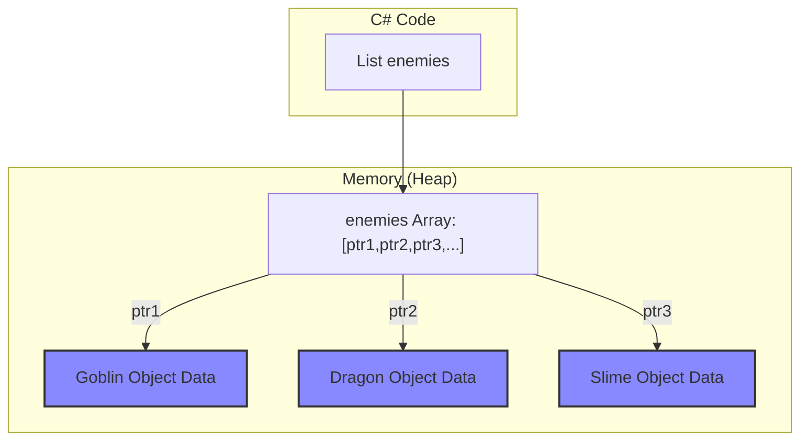
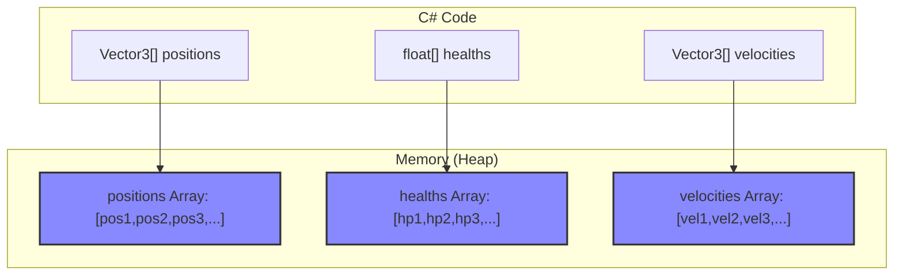
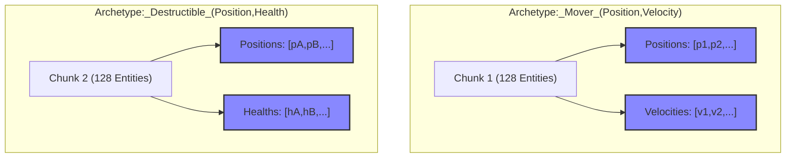

# 游戏开发架构设计：OOP, DOD 以及 ECS

## 前言

在现代游戏开发中，我们常常会遇到三种核心的编程形式：面向对象的编程（OOP）、面向数据的设计（DOD）以及实体组件系统（ECS）。

本文档旨在为开发者提供一个全面、深入的对比，从内存布局、性能影响到在实际项目模块中的应用，帮助您开发中选择合适合理的开发方案。

---

## 一、 面向对象的编程 (OOP - Object-Oriented Programming)

OOP 是传统的、最符合人类直觉的编程范式。它将世界视为由一个个独立、自治的“对象”组成。

### 1. 核心思想

*   **封装 (Encapsulation)**: 将数据（属性）和操作这些数据的方法（行为）捆绑在一个对象内部。
*   **继承 (Inheritance)**: 允许一个对象（子类）继承另一个对象（父类）的属性和行为，形成“is-a”（是一个）的关系。
*   **多态 (Polymorphism)**: 允许不同类的对象对同一消息做出不同的响应，通常通过虚方法实现。

### 2. 内存结构与性能

这是 OOP 在高性能场景下的**致命弱点**。

*   **内存布局**:
    *   对象的数据被随意地散落在内存（堆）的各个角落。
    *   当您有一个对象数组时（如 `List<Enemy>`），这个数组里存储的并不是真正的对象数据，而是指向这些数据的**指针（引用）**。

*   **性能影响**:
    *   **缓存未命中 (Cache Miss)**: 当CPU需要遍历处理大量对象时，它必须根据指针在内存中“东奔西跑”地查找数据。CPU缓存的设计初衷是加速对**连续内存**的访问，而这种跳跃式的访问模式会频繁导致缓存失效，CPU不得不花费大量时间等待从主内存中读取数据，这是性能的第一杀手。

*
图1: OOP 的内存布局 - 数据散乱，通过指针访问
*

### 3. OOP 的性能优化：对象池 (Object Pooling)

为了缓解 OOP 在频繁创建和销毁对象（如子弹、特效）时带来的巨大性能开销，业界发展出了一种标准的优化模式：**对象池**。

*   **核心思想**: 与其在需要时`Instantiate`、在用完后`Destroy`，不如维护一个“池”，将不用的对象暂时“禁用”并存放在池中。需要时，从池中取出一个已存在的对象并“激活”它。

*   **性能提升**:
    1.  **避免`Instantiate`/`Destroy`开销**: `Instantiate`和`Destroy`是Unity中非常缓慢的操作。对象池通过复用，将这部分开销平摊到了几乎为零。
    2.  **减少垃圾回收 (GC)**: 频繁创建和销毁对象会产生大量内存垃圾，导致游戏过程中出现卡顿（GC Spike）。对象池通过复用内存，极大地降低了GC压力。

*   **与 `CycloneGames.Factory` 的关系**: 您项目中的 **`CycloneGames.Factory`** 模块，正是这一思想的高性能、模块化实现。它提供的 `ObjectPool<T>` 就是一个健壮、线程安全、可自动扩缩容的对象池，是实践此优化模式的绝佳工具。

*   **局限性**:
    *   **对象池没有改变 OOP 的根本内存布局**。它解决的是**创建和销毁**的成本，但**没有解决**遍历大量**激活**对象时的**缓存未命中**问题。当您有成千上万个激活的池化对象时，它们的内存依然是散乱的，遍历性能依然低下。

因此，对象池是**对 OOP 的重大优化**，但它与 DOD 和 ECS 在解决性能问题的根本思路上是不同的。

---

## 二、 面向数据的设计 (DOD - Data-Oriented Design)

DOD 的核心思想与 OOP 完全相反：**优先考虑数据，而非对象**。它旨在设计出对硬件（尤其是CPU缓存）最友好的数据结构。

### 1. 核心思想

*   **数据为王**: 程序的核心是数据以及对数据的转换（Transformation）。
*   **数据连续性**: 将相同类型的数据紧凑地、连续地存储在一起。
*   **逻辑与数据分离**: 逻辑（代码）与它操作的数据是分开的。

### 2. 内存结构与性能

这是 DOD 的**核心优势**。

*   **内存布局**:
    *   不再有“Enemy”对象，取而代之的是多个**纯数据数组**。
    *   所有单位的位置信息存储在一个`Vector3[]`数组中，所有生命值信息存储在另一个`float[]`数组中。

*   **性能影响**:
    *   **缓存命中率极高**: 当一个系统需要更新所有单位的位置时，它可以从头到尾线性地读取一整块连续的内存。CPU缓存的预取机制能完美地发挥作用，将即将要用到的数据提前加载进来，从而实现惊人的计算速度。

*
图2: DOD 的内存布局 - 数据按类型连续存储
*

---

## 三、 实体组件系统 (ECS - Entity Component System)

ECS 是一种严格的、形式化的**架构模式**，它是 DOD 思想最彻底、最系统的实现。

### 1. 核心思想

*   **实体 (Entity)**: 一个简单的ID（通常是一个整数），它本身不包含任何数据和逻辑，仅用于唯一标识一个“事物”。
*   **组件 (Component)**: **纯粹的数据**，以`struct`的形式存在（如`PositionComponent`, `HealthComponent`）。一个实体的所有特征都由它所拥有的组件组合而成。
*   **系统 (System)**: **纯粹的逻辑**。系统会查询拥有特定组件组合的实体，并对这些组件数据进行批量处理。

### 2. 内存结构与性能

ECS 将 DOD 的理念推向了极致。

*   **内存布局**:
    *   ECS 框架（如Unity DOTS）会自动根据实体拥有的**组件类型组合**（称为**原型 Archetype**），将这些组件数据存储在**块**（称为 **Chunk**）的连续内存区域中。
    *   一个Chunk内，相同类型的组件数据（如所有`PositionComponent`）会再次被紧凑地排列在一起。

*   **性能影响**:
    *   **极致的缓存命中率**: 系统在遍历时，访问的是完美连续的、没有任何杂质的数据块。

*
图3: ECS 的内存布局 - 数据按原型分块，块内按类型连续存储
*

---

## 四、 全方位对比

| 特性 | OOP (纯粹) | **OOP + 对象池** | DOD (手动实现) | ECS (框架) |
| :--- | :--- | :--- | :--- | :--- |
| **核心思想** | 对象是数据和逻辑的统一体 | **复用对象以避免创建/销毁开销** | 数据布局优先，逻辑与数据分离 | 实体是ID，组件是数据，系统是逻辑 |
| **内存布局** | 零散，基于指针 | **零散，基于指针** | 连续，按数据类型（SoA） | 极致连续，按原型分块（Chunk） |
| **CPU缓存性能** | **差** (大量缓存未命中) | **差** (未解决) | **非常好** | **极致** |
| **GC性能** | **差** (频繁分配/回收) | **非常好** (几乎无GC) | **非常好** | **极致** |
| **代码复用** | 继承、多态 | 继承、多态 | 泛型系统、组合 | 组合、泛型系统 |
| **适用场景** | 独特的、复杂的、数量少的个体 | **频繁生灭的、数量中等的个体** | 大量的、行为简单的、相似的群体 | 整个游戏或大型复杂系统追求极致性能 |

---

## 五、 真实游戏项目中的应用

在任何一个复杂的游戏中，最佳应用是根据不同模块的特点，采用**混合式架构**，让每种模式都在其最擅长的领域发挥作用。

> 作者建议在实际开发中，场景内同类的数量大致在 200 个左右的时候就该考虑替换成 DOD 设计而不是继续使用 OOP。

#### 1. 玩家/Boss/NPC 核心逻辑 (适用：OOP)

*   **特点**: 玩家、Boss和关键NPC是**独一无二**的。他们的行为由复杂的、不可预测的事件（玩家输入、AI决策树、剧情触发）驱动，状态机极其复杂。
*   **具体情景**:
    *   `PlayerController.cs`: 接收输入，控制动画状态机。
    *   `Boss_PhaseManager.cs`: 管理Boss在不同阶段的复杂行为切换。
    *   `QuestGiver.cs`: 处理与玩家的对话、任务授予等逻辑。
    *   **`GameplayAbilities` 系统**: 这是一个完美的 OOP 框架，用于管理这些**个体**的复杂技能和属性。

#### 2. UI系统 (适用：OOP)

*   **特点**: UI本质上是**事件驱动**和**层级化**的。每个按钮、窗口都是一个独特的对象，有自己的状态和回调。OOP 的事件模型和组件化（如Unity UGUI）是处理UI的最佳方式。
*   **具体情景**:
    *   `MainMenuController.cs`: 管理主菜单按钮的点击事件。
    *   `InventorySlot.cs`: 处理单个物品槽的拖拽、点击逻辑。

#### 3. 游戏核心系统 (适用：OOP)

*   **特点**: 像任务系统、存档系统、剧情管理器等，它们的核心是**复杂的逻辑和数据关系**，而不是海量数据的批量计算。性能通常不是这些模块的瓶颈。
*   **具体情景**:
    *   `QuestManager.cs`: 追踪任务进度，管理任务依赖。
    *   `SaveLoadManager.cs`: 序列化和反序列化游戏状态。

#### 4. 视觉特效/弹幕系统 (适用：OOP + 对象池 或 DOD)

*   **特点**: 一个技能可能瞬间产生大量粒子或子弹。
*   **决策**:
    *   **当数量在“中等”范围（如几十到几百个）**: **OOP + 对象池** 是一个绝佳选择。它能完美解决频繁创建销毁带来的GC和CPU开销，且开发流程符合Unity直觉。**`CycloneGames.Factory`** 在此场景下非常适用。
    *   **当数量达到“海量”（成千上万）**: 此时遍历激活对象的缓存效率成为新瓶颈，**DOD** 成为唯一选择。
*   **具体情景**:
    *   **常规射击游戏的子弹**: 使用对象池管理的 `GameObject` Prefab。
    *   **弹幕射击游戏的弹幕海**: 使用 DOD 设计。
    *   **VFX Graph / Particle System**: 使用 DOD 思想。

#### 5. 程序化环境 (适用：DOD)

*   **特点**: 渲染一片广袤的森林、草原或陨石带，如果为每一棵草、每一块石头都创建一个`GameObject`，会瞬间耗尽性能。
*   **具体情景**:
    *   **DOD 森林模拟**: 管理成千上万棵树的生长和渲染。
    *   **草地模拟**，使用`DrawMeshInstanced`来渲染百万级别的草叶。(Unity 中的 API)

#### 6. 大规模AI群组/模拟 (适用：ECS)

*   **特点**: 这是 DOD 设计最复杂的挑战。不仅需要处理海量单位的移动（DOD 擅长），还需要处理单位之间复杂多变的**行为组合**（寻路、攻击、防御、结队、逃跑等）。ECS 的灵活性和极致性能在这里才能完全发挥。
*   **具体情景**:
    *   **战争模拟**: 一个系统负责所有单位的寻路，另一个系统负责所有单位的索敌，再一个系统负责所有单位的攻击计算。
    *   **城市模拟**: 一个系统处理所有市民的上下班通勤，另一个系统处理所有车辆的交通流。

---