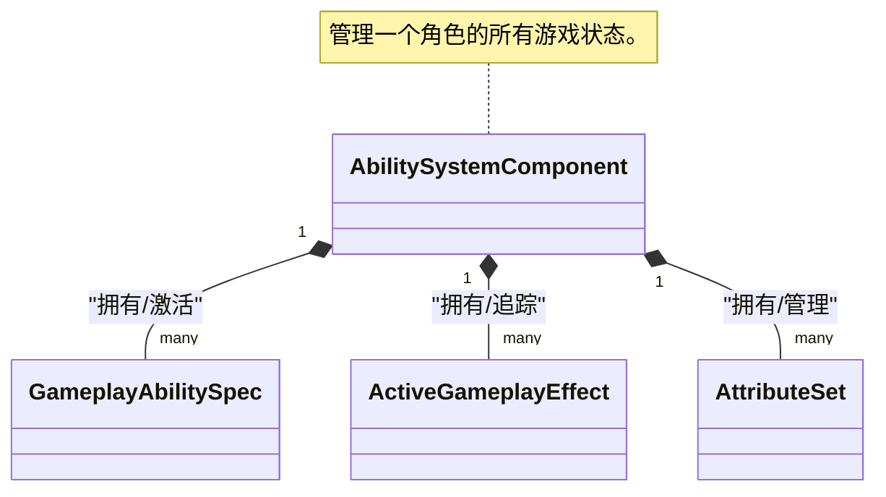
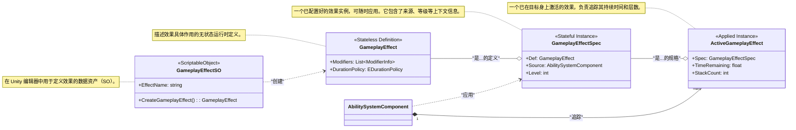
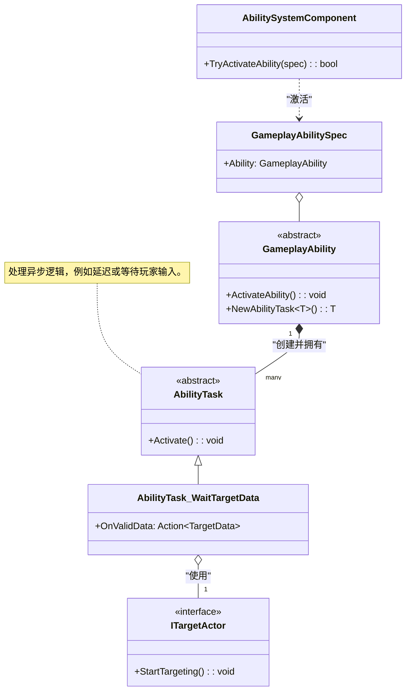
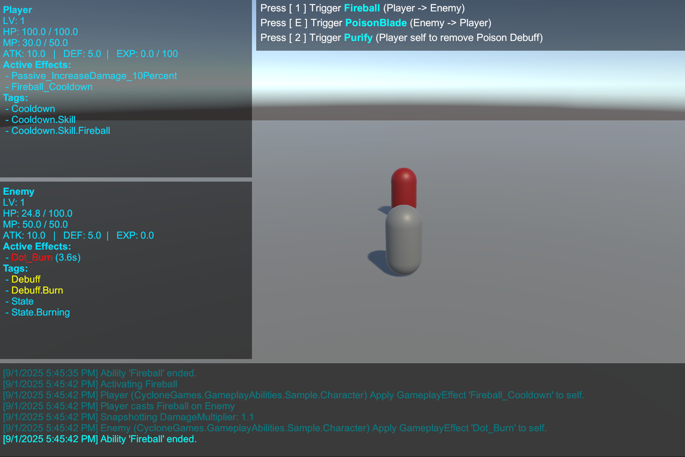

> **注意：** 本文档由AI辅助编写，如果你追求绝对精准，请直接阅读模块源码, **源码**以及**示例**皆由作者编写。

[**English**](README.md) | [**简体中文**]

# CycloneGames.GameplayAbilities

CycloneGames.GameplayAbilities 是一个为 Unity 打造的、功能强大且高度灵活的游戏性能力系统（Gameplay Ability System），其设计深受虚幻引擎（Unreal Engine）著名的 Gameplay Ability System (GAS) 的启发。本系统从零开始构建，以数据驱动为核心，充分利用 Unity 的 `ScriptableObject` 架构，为您提供一个健壮的框架，只需极少的代码即可创建复杂的技能、属性和状态效果。

本系统非常适合开发 RPG、MOBA 或任何需要精细技能和属性系统的游戏。它的设计旨在对初学者友好，同时也能提供专业项目所需的深度。

## GAS的设计哲学：技能系统的范式转移

在深入技术细节之前，理解GAS这类系统为何存在，以及它与传统方法有何根本不同，是至关重要的。

### 传统系统的困境

在许多项目中，能力逻辑起初很简单，但很快就会失控。一个典型的问题演变过程如下：

1.  **硬编码的能力：** `PlayerController` 中有一个 `UseFireball()` 函数。这很简单，但如果敌人也需要用火球术呢？你复制了代码。如果一个陷阱也需要呢？你又复制了一遍。逻辑与角色紧密地耦合在了一起。
2.  **“上帝”控制器：** 为了管理复杂性，开发者会创建一个庞大的 `SkillManager` 或不断扩展 `PlayerController` 来处理每一个技能、增益和交互。这个类变成了一个巨大的状态机，充满了布尔标志位（`isStunned`, `isPoisoned`, `isBurning`）、`Update()` 中的计时器，以及长长的 `switch` 或 `if/else` 链。它变得脆弱、难以调试，并成为团队协作的瓶颈。
3.  **数据与逻辑的纠缠：** 游戏设计师想要微调一个技能的伤害或持续时间。在传统系统中，这通常意味着他们必须冒险深入复杂的代码文件，这很可能引入错误。数据（`damage = 10`）与逻辑（`target.TakeDamage(damage)`）密不可分。

这种方法不具备可扩展性。技能和状态之间的潜在交互数量呈指数级增长，最终导致通常所说的“意大利面条式代码”。

### GAS的解决方案：将能力和效果视为数据

GAS通过将能力和效果不视为函数，而是视为**数据**来解决这些问题。这是核心的范式转变。

*   **GameplayAbilities是数据资产 (`GameplayAbilitySO`):** 一个“能力”就是一个 `ScriptableObject`，它封装了自身的逻辑，并链接到定义其消耗、冷却和效果的其他数据资产。你的角色不需要知道“火球术”是什么；它只知道自己拥有一个由 `GameplayTag` 标识的能力。
*   **状态效果是数据资产 (`GameplayEffectSO`):** 一个角色不再仅仅是 `isPoisoned`。相反，他身上有一个“中毒”`GameplayEffect`资产的**活动实例**。这个资产*就是*中毒效果本身。它包含了所有相关数据：持续时间、周期性伤害、它赋予的GameplayTag（`Status.Debuff.Poison`），甚至它如何与其他中毒效果叠加。系统会自动管理其整个生命周期。
*   **通过标签解耦 (`GameplayTag`):** 标签是GAS的通用语言。它们被用来识别一切：能力（`Ability.Skill.Fireball`）、冷却（`Cooldown.Skill.Fireball`）、状态效果（`Status.Debuff.Poison`）、角色状态（`State.Stunned`），甚至是伤害类型（`Damage.Type.Fire`）。系统使用标签来提问，例如：“能力所有者是否拥有`Cooldown.Skill.Fireball`标签？”或“目标是否对`Damage.Type.Fire`标签免疫？”。这创建了一个强大的、解耦的系统，不同的部分可以在没有直接引用的情况下进行交互。

这种以数据为中心的方法赋予了设计师权力，促进了可重用性，简化了调试（你检查的是数据资产，而不是复杂的调用堆栈），并为你的游戏机制创建了一个健壮、可扩展的基础。

### 对比：传统方法 vs. GAS

| 方面           | 传统系统 (痛点)                                                                                                   | CycloneGames.GameplayAbilities (解决方案)                                                                                                                                 |
| :------------- | :---------------------------------------------------------------------------------------------------------------- | :------------------------------------------------------------------------------------------------------------------------------------------------------------------------ |
| **架构**       | 庞大的单体类（`PlayerController`, `SkillManager`），逻辑硬编码。                                                  | 解耦的组件（`AbilitySystemComponent`）和数据资产（`GameplayAbilitySO`）。                                                                                                 |
| **数据与逻辑** | **紧密耦合。** 技能逻辑（`UseFireball()`）和数据（`damage = 10`）混合在同一个C#文件中。设计师无法安全地平衡游戏。 | **严格分离。** 数据存储在 `ScriptableObject` 资产（`GameplayAbilitySO`）中。逻辑在运行时的 `GameplayAbility` 类中。设计师与资产打交道，程序员与代码打交道。               |
| **状态管理**   | **手动且脆弱。** 依赖布尔标志位（`isStunned`）、`Update()`中的手动计时器，以及难以调试和扩展的复杂状态机。        | **自动且健壮。** 状态效果是自包含的 `GameplayEffect` 实例。系统自动管理其持续时间、周期性应用和清理。状态是一个对象，而不是一个标志位。                                   |
| **可扩展性**   | **侵入式。** 添加新技能或状态效果通常需要修改多个核心类，增加了回归错误的风险。                                   | **模块化。** 通过创建新的 `GameplayAbilitySO` 资产及其对应的 `GameplayAbility` 类来添加新能力。无需更改现有代码。                                                         |
| **可复用性**   | **低。** 为玩家编写的技能通常必须为AI重写，因为它与 `PlayerController` 绑定。                                     | **高。** 同一个 `GameplayAbilitySO` 资产可以授予任何 `AbilitySystemComponent`，无论它是在玩家、AI，还是一个可打破的木桶上。                                               |
| **复杂性处理** | **指数级增长。** 随着技能和效果的增加，用于交互的 `if/else` 检查数量呈指数级增长，导致代码无法维护。              | **线性且由标签驱动。** 交互由 `GameplayTags` 管理。一个能力检查“我是否拥有`Cooldown.Fireball`？”而不是`if (skillManager.fireball_cooldown > 0)`。这种方式可以干净地扩展。 |

## 架构深度解析
- Core Interaction Overview

- Gameplay Effect Lifecycle

- Ability Activation & Tasks


## 示例详解 (Sample Walkthrough)

`Samples` 文件夹包含一个功能齐全的示例场景，演示了本游戏性能力系统的多项核心功能，包括复杂的技能实现和一个完整的升级系统。它直观地展示了数据驱动架构在实际项目中的应用方式。

### 示例场景概览

`SampleScene.unity` 场景中包含一个 **Player** (玩家) 和一个 **Enemy** (敌人) 角色，两者都挂载了 `AbilitySystemComponentHolder`（一个MonoBehaviour包装器），该包装器负责管理其底层的 `AbilitySystemComponent` 和 `CharacterAttributeSet` 实例。场景中的 `SampleCombatManager` 脚本负责处理玩家输入、更新UI界面，以实时显示每个角色的状态，包括他们的属性、当前激活的Gameplay Effect和拥有的Gameplay Tag。

-   **玩家控制:**
    -   **[1] 键:** 对敌人释放 **火球术 (Fireball)**。
    -   **[2] 键:** 对自己释放 **净化 (Purify)**，以移除中毒效果。
    -   **[空格] 键:** 给自己增加50点经验值，用于测试升级系统。
-   **敌人控制:**
    -   **[E] 键:** 强制敌人对玩家释放 **淬毒之刃 (PoisonBlade)**。

### 核心示例组件

-   **`Character.cs`**: 玩家和敌人的基类脚本。它负责初始化 `AbilitySystemComponent`，授予初始能力和效果，并包含处理角色升级的核心逻辑。
-   **`CharacterAttributeSet.cs`**: 定义了示例角色的所有属性（如 `Health`, `Mana`, `AttackPower`, `Defense`, `Level`, `Experience`）。它还包含了更高级的逻辑，例如伤害计算（根据防御力减免伤害）和处理角色死亡。

### 特色能力展示

#### 1. 火球术 (Fireball) - 直接伤害 + 持续伤害 (DoT)

火球术是一个攻击性技能，造成一次性的立即伤害，并附加一个持续的燃烧效果。它主要展示了：

-   **数据驱动设计**: 该能力由 `GA_Fireball_SO` 定义。这个 ScriptableObject 资产文件链接了多个 `GameplayEffectSO` 资产，分别定义了其法力 **消耗**、**冷却时间**、立即**冲击伤害**以及**燃烧DoT**。
-   **复杂的属性交互**: 最终伤害不是一个简单的数字。当伤害 `GameplayEffect` 被应用时，目标的 `CharacterAttributeSet` 会在其 `PreProcessInstantEffect` 方法中拦截它。然后，它会根据目标的 `Defense` (防御) 属性计算伤害减免，最后才施加最终的生命值扣减。
-   **属性快照 (`SetSetByCallerMagnitude`)**: 当火球术被释放时，它会“快照”玩家那一刻的 `BonusDamageMultiplier`（额外伤害倍率）属性。这个值被传入 `GameplayEffectSpec`，确保最终的伤害计算使用的是施法瞬间的属性，而不是命中瞬间的属性。

#### 2. 淬毒之刃 (PoisonBlade) - 直接伤害 + 减益效果 (Debuff)

这是敌人的主要攻击技能。它是一个典型的“立即伤害 + 持续性Debuff”的简单示例。

-   **应用多个效果**: `GA_PoisonBlade` 技能会依次应用两个独立的 `GameplayEffect`：一个用于造成初始的武器命中伤害，另一个用于施加 `Debuff.Poison` 标签及其关联的周期性毒素伤害。

#### 3. 净化 (Purify) - 范围效果 (AoE) + 驱散

净化是一个防御性技能，用于移除施法者身上的中毒效果。它展示了几个高级概念：

-   **异步能力**: 净化的逻辑不是立即执行的。它使用 `AbilityTask_WaitTargetData` 来异步执行其逻辑。
-   **目标Actor (Targeting Actors)**: 它使用 `GameplayAbilityTargetActor_SphereOverlap` 在施法者周围进行球形范围检测，以寻找所有有效的目标。
-   **阵营过滤**: 该能力在其 `SO` 资产中被配置为只影响友方目标（拥有 `Faction.Player` 标签的角色），这演示了如何使用标签来进行精确的目标筛选。
-   **按标签移除效果**: 驱散的核心逻辑仅需一行代码：`RemoveActiveEffectsWithGrantedTags`。它会移除目标身上任何授予了 `Debuff.Poison` 标签的 `GameplayEffect`。

### 升级系统

示例中包含一个完全由 `GameplayEffect` 驱动的升级系统。

-   **获得经验**: 当敌人死亡时，它的 `BountyEffect` (悬赏效果) 会被应用给玩家。这个效果 (`GE_Bounty_Enemy.asset`) 的作用很简单，就是为玩家增加一定数量的 `Experience` (经验值) 属性。
-   **触发升级**: `CharacterAttributeSet` 会监听 `Experience` 属性的变化。当经验值增加后，它会调用 `Character` 脚本中的 `CheckForLevelUp` 方法。
-   **应用升级属性**: `CheckForLevelUp` 方法会计算角色升了多少级，并在代码中**动态创建**一个新的、临时的 `GameplayEffect`。这个Effect包含了用于提升 `Level`、`MaxHealth`、`MaxMana` 等多项属性的修改器。这展示了本系统在运行时动态创建并应用效果的灵活性。

## 综合快速上手指南

本指南将引导你完成创建简单“治疗”能力的每一步。

### 第1部分：项目和文件夹设置

1.  **安装包：** 确保 `CycloneGames.GameplayAbilities` 包及其依赖项（`GameplayTags`, `Logger`等）已安装在你的Unity项目中。
2.  **创建文件夹：** 为了保持整洁，在你的 `Assets` 文件夹内创建以下文件夹结构：
    *   `_Project/Scripts/Attributes`
    *   `_Project/Scripts/Abilities`
    *   `_Project/Data/Effects`
    *   `_Project/Data/Abilities`
    *   `_Project/Prefabs`

### 第2部分：创建核心组件

**步骤2.1：属性集 (AttributeSet)**
这个类将定义你角色所拥有的属性。

1.  在 `_Project/Scripts/Attributes` 文件夹内，创建一个名为 `PlayerAttributeSet.cs` 的新C#脚本。
2.  打开文件，并用以下代码替换其全部内容：

```csharp
// _Project/Scripts/Attributes/PlayerAttributeSet.cs
using CycloneGames.GameplayAbilities.Runtime;
using UnityEngine;

// 这个类定义了我们角色的属性。
public class PlayerAttributeSet : AttributeSet
{
    // 使用字符串名称定义属性，这些名称通常来自一个集中的标签类。
    public readonly GameplayAttribute Health = new GameplayAttribute("Player.Attribute.Health");
    public readonly GameplayAttribute MaxHealth = new GameplayAttribute("Player.Attribute.MaxHealth");
    public readonly GameplayAttribute Mana = new GameplayAttribute("Player.Attribute.Mana");

    public override void PreAttributeChange(GameplayAttribute attribute, ref float newValue)
    {
        // 这个函数在属性的 CurrentValue 被改变之前调用。
        // 这是将数值约束在有效范围内的绝佳位置。
        if (attribute.Name == "Player.Attribute.Health")
        {
            newValue = Mathf.Clamp(newValue, 0, GetCurrentValue(MaxHealth));
        }
    }
}
```

**步骤2.2：角色控制器**
这个简单的脚本将用于授予和激活能力。

1.  在 `_Project/Scripts` 文件夹内，创建一个名为 `PlayerCharacter.cs` 的新C#脚本。
2.  用以下代码替换其内容：

```csharp
// _Project/Scripts/Characters/PlayerCharacter.cs
using CycloneGames.GameplayAbilities.Runtime;
using UnityEngine;

// 该组件要求 AbilitySystemComponentHolder 必须在同一个 GameObject 上。
[RequireComponent(typeof(AbilitySystemComponentHolder))]
public class PlayerCharacter : MonoBehaviour
{
    [SerializeField] private GameplayAbilitySO healAbilitySO;
    
    private AbilitySystemComponentHolder ascHolder;
    private PlayerAttributeSet playerAttributes;

    private void Awake()
    {
        // 获取 Holder 组件。
        ascHolder = GetComponent<AbilitySystemComponentHolder>();
    }

    private void Start()
    {
        // 初始化能力系统组件，告诉它谁是所有者（本脚本）
        // 以及谁是它的化身（本 GameObject）。
        ascHolder.AbilitySystemComponent.InitAbilityActorInfo(this, this.gameObject);

        // 创建我们的 AttributeSet 实例并将其添加到 ASC 中。
        // 这是至关重要的一步！
        playerAttributes = new PlayerAttributeSet();
        ascHolder.AbilitySystemComponent.AddAttributeSet(playerAttributes);

        // 如果在检视面板中指定了治疗能力的SO，就授予该能力。
        if (healAbilitySO != null)
        {
            ascHolder.AbilitySystemComponent.GrantAbility(healAbilitySO.CreateAbility());
        }
    }

    private void Update()
    {
        // 当按下 'H' 键时，尝试激活治疗能力。
        if (Input.GetKeyDown(KeyCode.H))
        {
            // 我们通过查找具有正确标签的已授予能力（spec）来激活它。
            var abilities = ascHolder.AbilitySystemComponent.GetActivatableAbilities();
            foreach (var spec in abilities)
            {
                if (spec.Ability.AbilityTags.HasTag("Ability.Action.Heal"))
                {
                    ascHolder.AbilitySystemComponent.TryActivateAbility(spec);
                    break; // 找到并激活第一个匹配项后停止。
                }
            }
        }
    }
}
```

### 第3部分：创建治疗能力

现在我们将创建我们能力的两个部分：运行时逻辑 (`HealAbility.cs`) 和面向编辑器的的数据资产 (`HealAbilitySO.cs`)。

**步骤3.1：运行时逻辑**
1.  在 `_Project/Scripts/Abilities` 文件夹内，创建一个名为 `HealAbility.cs` 的新C#脚本。
2.  用以下代码替换其内容。这是能力激活时运行的代码。

```csharp
// _Project/Scripts/Abilities/HealAbility.cs
using CycloneGames.GameplayAbilities.Runtime;
using CycloneGames.Logger;

public class HealAbility : GameplayAbility
{
    public override void ActivateAbility(GameplayAbilityActorInfo actorInfo, GameplayAbilitySpec spec, GameplayAbilityActivationInfo activationInfo)
    {
        CLogger.LogInfo("治疗能力已激活");
        
        // 此方法会应用消耗（Cost）和冷却（Cooldown）的GameplayEffect。
        // 如果在SO中还定义了提交时应用的效果，也会在这里被应用。
        CommitAbility(actorInfo, spec);
        
        // 这是一个“即时”能力，所以在完成后立即结束它。
        EndAbility();
    }

    // 这是对象池系统所要求的。它只需要返回一个自己的新实例。
    public override GameplayAbility CreatePoolableInstance()
    {
        return new HealAbility();
    }
}
```

**步骤3.2：ScriptableObject工厂**
这个类将允许你在Unity编辑器中创建数据资产。

1.  在 `_Project/Scripts/Abilities` 文件夹内，创建一个名为 `HealAbilitySO.cs` 的新C#脚本。
2.  用以下代码替换其内容：

```csharp
// _Project/Scripts/Abilities/HealAbilitySO.cs
using UnityEngine;
using CycloneGames.GameplayAbilities.Runtime;

[CreateAssetMenu(fileName = "GA_Heal", menuName = "Cyclone/Abilities/Heal")]
public class HealAbilitySO : GameplayAbilitySO
{
    // 这是工厂方法。它在编辑器数据和运行时逻辑之间架起了一座桥梁。
    public override GameplayAbility CreateAbility()
    {
        var abilityInstance = new HealAbility();
        
        // 这个调用将所有在检视面板中配置的数据
        // 传递给能力的运行时实例。
        abilityInstance.Initialize(
            AbilityName, 
            InstancingPolicy, 
            NetExecutionPolicy, 
            CostEffect?.CreateGameplayEffect(),
            CooldownEffect?.CreateGameplayEffect(),
            AbilityTags,
            ActivationBlockedTags,
            ActivationRequiredTags,
            CancelAbilitiesWithTag,
            BlockAbilitiesWithTag
        );
        
        return abilityInstance;
    }
}
```
*注意：`CostEffect?.CreateGameplayEffect()` 这部分假设你的 `GameplayEffectSO` 有一个方法来创建运行时的 `GameplayEffect` 实例。如果你的方法名不同，请相应调整。*

### 第4部分：在Unity中组装和配置

**步骤4.1：创建效果资产**
1.  在项目窗口中，导航到 `_Project/Data/Effects`。
2.  右键 > `Create > CycloneGames > GameplayAbilities > GameplayEffect`。命名为 `GE_Heal`。
3.  选择 `GE_Heal.asset`。在检视面板中，进行配置：
    *   **Duration Policy:** `Instant`。
    *   **Modifiers:**
        *   点击 `+` 添加一个元素。
        *   **Attribute:** 选择 `PlayerAttributeSet.Health`。
        *   **Operation:** `Add`。
        *   **Magnitude:** 设置为 `25`。

**步骤4.2：创建能力资产**
1.  在项目窗口中，导航到 `_Project/Data/Abilities`。
2.  右键 > `Create > Cyclone > Abilities > Heal`。命名为 `GA_Heal`。
3.  选择 `GA_Heal.asset`。在检视面板中，进行配置：
    *   **Ability Name:** `Simple Heal`
    *   **Instancing Policy:** `InstancedPerActor`
    *   **Ability Tags:**
        *   点击 `+` 并添加标签 `Ability.Action.Heal`。
    *   **Commit Gameplay Effects:** （假设在提交时有一个要应用的效果列表）
        *   点击 `+` 并将 `GE_Heal.asset` 资产拖入该槽位。

**步骤4.3：构建玩家预制件(Prefab)**
1.  在你的场景中创建一个空的 `GameObject` 并命名为 `Player`。
2.  向其添加以下组件：
    * `Ability System Component Holder`
    * `Player Character`
3.  在 `Player Character` 组件中，将你项目文件夹中的 `GA_Heal.asset` 拖到 `Heal Ability SO` 字段中。
4.  将 `Player` GameObject 从层级视图拖到你的 `_Project/Prefabs` 文件夹中以创建预制件。

**步骤4.4：测试！**
运行场景。由于 `PlayerAttributeSet` 是一个纯C#类，你无法在检视面板中直接看到属性。为了测试，你可以在 `PlayerAttributeSet` 的 `PreAttributeChange` 方法中添加一句 Debug.Log 来观察数值变化。按下 `H` 键，你应该会在控制台中看到 "治疗能力已激活" 的日志。

## Demo Preview
-   DemoLink: [https://github.com/MaiKuraki/UnityGameplayAbilitySystemSample](https://github.com/MaiKuraki/UnityGameplayAbilitySystemSample)
-   
-   

## 依赖项

本包依赖于以下外部和内部包：

*   `com.cysharp.unitask`: 用于异步操作。
*   `com.cyclone-games.assetmanagement`: 资源加载接口。
*   `com.cyclone-games.gameplay-tags`: 用于底层的 `GameplayTag` 系统。
*   `com.cyclone-games.logger`: 用于调试日志记录。
*   `com.cyclone-games.factory`: 用于对象创建和池化。
