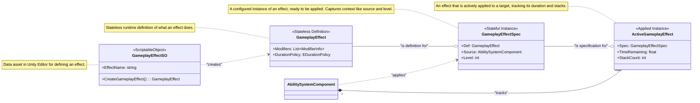

> **Note:** This document was written with AI assistance. If you are looking for absolute accuracy, please read the source code directly. Both the **source code** and the **examples** were written by the author.

[**English**] | [**简体中文**](README.SCH.md)

# CycloneGames.GameplayAbilities

CycloneGames.GameplayAbilities is a powerful and flexible gameplay ability system for Unity, heavily inspired by Unreal Engine's renowned Gameplay Ability System (GAS). It's designed from the ground up to be data-driven, leveraging Unity's `ScriptableObject` architecture to provide a robust framework for creating complex skills, attributes, and status effects with minimal new code.

This system is perfect for developers working on RPGs, MOBAs, or any game that requires a sophisticated skill and attribute system. It is designed to be intuitive for beginners while offering the depth required by professional projects.

## The GAS Philosophy: A Paradigm Shift for Skill Systems

Before diving into the technical details, it's crucial to understand *why* a system like GAS exists and how it fundamentally differs from traditional approaches.

### The Trouble with Traditional Systems

In many projects, ability logic starts simple but quickly spirals out of control. A typical evolution of problems looks like this:

1.  **Hard-coded Abilities:** A `PlayerController` has a function like `UseFireball()`. This is simple, but what if an enemy needs to use it? You copy the code. What if a trap needs to use it? You copy it again. The logic is tightly coupled to the character.
2.  **The "God" Controller:** To manage complexity, developers create a monolithic `SkillManager` or expand the `PlayerController` to handle every skill, buff, and interaction. This class becomes a massive state machine, full of boolean flags (`isStunned`, `isPoisoned`, `isBurning`), timers in `Update()`, and long `switch` or `if/else` chains. It becomes fragile, difficult to debug, and a bottleneck for team collaboration.
3.  **Data & Logic Tangled:** Game designers want to tweak a skill's damage or duration. In traditional systems, this often means they have to venture into complex code files, risking the introduction of bugs. The data (`damage = 10`) is inseparable from the logic (`target.TakeDamage(damage)`).

This approach is not scalable. The number of potential interactions between skills and states grows exponentially, leading to what is commonly known as "spaghetti code."

### The GAS Solution: Abilities and Effects as Data

GAS solves these problems by treating abilities and effects not as functions, but as **data**. This is the core paradigm shift.

*   **GameplayAbilities are Data Assets (`GameplayAbilitySO`):** An "ability" is a `ScriptableObject` that encapsulates its logic and links to other data assets that define its cost, cooldown, and effects. Your character doesn't know what "Fireball" is; it just knows it has an ability identified by a `GameplayTag`.
*   **Status Effects are Data Assets (`GameplayEffectSO`):** A character is no longer just `isPoisoned`. Instead, they have an **active instance** of a "Poison" `GameplayEffect` asset. This asset *is* the poison. It contains all relevant data: its duration, its periodic damage, the gameplay tags it applies (`Status.Debuff.Poison`), and even how it stacks with other poison effects. The system manages its entire lifecycle automatically.
*   **Decoupling through Tags (`GameplayTag`):** Tags are the universal language of GAS. They are used to identify everything: abilities (`Ability.Skill.Fireball`), cooldowns (`Cooldown.Skill.Fireball`), status effects (`Status.Debuff.Poison`), character states (`State.Stunned`), and even damage types (`Damage.Type.Fire`). The system uses tags to ask questions like, "Does the ability owner have the `Cooldown.Skill.Fireball` tag?" or "Is the target immune to the `Damage.Type.Fire` tag?" This creates a powerful, decoupled system where different parts can interact without direct references.

This data-centric approach empowers designers, promotes reusability, simplifies debugging (you inspect data assets, not complex call stacks), and creates a robust, scalable foundation for your game's mechanics.

### Comparison: Traditional vs. GAS

| Aspect                  | Traditional System (The "Pain Points")                                                                                                                 | CycloneGames.GameplayAbilities (The "Solution")                                                                                                                                                           |
| :---------------------- | :----------------------------------------------------------------------------------------------------------------------------------------------------- | :-------------------------------------------------------------------------------------------------------------------------------------------------------------------------------------------------------- |
| **Architecture**        | Monolithic (`PlayerController`, `SkillManager`) with hard-coded logic.                                                                                 | Decoupled components (`AbilitySystemComponent`) and data assets (`GameplayAbilitySO`).                                                                                                                    |
| **Data & Logic**        | **Tightly Coupled.** Skill logic (`UseFireball()`) and data (`damage = 10`) are mixed in the same C# file. Designers cannot safely balance the game.   | **Strictly Separated.** Data is stored in `ScriptableObject` assets (`GameplayAbilitySO`). Logic is in the runtime `GameplayAbility` class. Designers work with assets, programmers work with code.       |
| **State Management**    | **Manual & Fragile.** Relies on boolean flags (`isStunned`), manual timers in `Update()`, and complex state machines that are hard to debug and scale. | **Automated & Robust.** Status effects are self-contained `GameplayEffect` instances. The system automatically manages their duration, periodic application, and cleanup. State is an object, not a flag. |
| **Extensibility**       | **Invasive.** Adding a new skill or status effect often requires modifying multiple core classes, increasing the risk of regression bugs.              | **Modular.** Add a new ability by creating a new `GameplayAbilitySO` asset and its corresponding `GameplayAbility` class. No changes to existing code are needed.                                         |
| **Reusability**         | **Low.** A skill written for the Player must often be rewritten for an AI, as it's tied to the `PlayerController`.                                     | **High.** The same `GameplayAbilitySO` asset can be granted to any `AbilitySystemComponent`, whether it's on a player, an AI, or even a breakable barrel.                                                 |
| **Complexity Handling** | **Exponential.** As skills and effects are added, the number of `if/else` checks for interactions grows exponentially, leading to unmaintainable code. | **Linear & Tag-Driven.** Interactions are managed by `GameplayTags`. An ability checks "Do I have `Cooldown.Fireball`?" instead of `if (skillManager.fireball_cooldown > 0)`. This scales cleanly.        |

## Architecture Deep Dive
- Core Interaction Overview

- Gameplay Effect Lifecycle

- Ability Activation & Tasks


## Sample Walkthrough

The `Samples` folder contains a practical scene demonstrating several key features of the Gameplay Ability System, including complex abilities and a leveling system. This provides a hands-on look at how the data-driven architecture works in practice.

### Sample Scene Overview

The `SampleScene.unity` features a **Player** and an **Enemy** character, each equipped with an `AbilitySystemComponentHolder` (the MonoBehaviour wrapper) which manages their underlying `AbilitySystemComponent` and `CharacterAttributeSet` instances. The `SampleCombatManager` script handles player input and updates the UI to reflect the real-time status of each character, including their attributes, active gameplay effects, and gameplay tags.

-   **Player Controls:**
    -   **[1] Key:** Cast **Fireball** on the Enemy.
    -   **[2] Key:** Cast **Purify** to remove poison debuffs from self.
    -   **[Space] Key:** Grant self 50 XP for testing the leveling system.
-   **Enemy Controls:**
    -   **[E] Key:** Force the Enemy to cast **PoisonBlade** on the Player.

### Core Sample Components

-   **`Character.cs`**: The base script for both Player and Enemy. It initializes the `AbilitySystemComponent`, grants initial abilities and effects, and contains the logic for leveling up.
-   **`CharacterAttributeSet.cs`**: Defines all character stats (`Health`, `Mana`, `AttackPower`, `Defense`, `Level`, `Experience`). It also contains advanced logic for damage calculation (mitigating damage based on defense) and handling character death.

### Featured Abilities

#### 1. Fireball (Direct Damage + Damage over Time)

Fireball is an offensive ability that deals instant damage and applies a lingering burn effect. It demonstrates:

-   **Data-Driven Design**: The ability is defined by `GA_Fireball_SO`. This ScriptableObject links to other `GameplayEffectSO` assets for its mana **cost**, **cooldown**, instant **impact damage**, and the **burn DoT**.
-   **Complex Attribute Interaction**: The final damage isn't just a simple number. When the damage `GameplayEffect` is applied, the target's `CharacterAttributeSet` intercepts it in its `PreProcessInstantEffect` method. It then calculates damage mitigation based on the target's `Defense` attribute before applying the final health reduction.
-   **Stat Snapshotting (`SetSetByCallerMagnitude`):** When Fireball is cast, it "snapshots" the player's `BonusDamageMultiplier` attribute at that moment. This value is passed into the `GameplayEffectSpec`, ensuring that the damage calculation uses the stats from the time of casting, not the time of impact.

#### 2. PoisonBlade (Direct Damage + Debuff)

This is the Enemy's primary attack. It's a straightforward example of an ability that applies both instant damage and a persistent poison debuff.

-   **Applying Multiple Effects:** The `GA_PoisonBlade` ability applies two separate `GameplayEffect`s in sequence: one for the initial weapon hit and another to apply the `Debuff.Poison` tag and its associated damage-over-time.

#### 3. Purify (Area of Effect Dispel)

Purify is a defensive ability that removes poison effects from the caster. It showcases several advanced concepts:

-   **Asynchronous Abilities:** Purify does not execute instantly. It uses an `AbilityTask_WaitTargetData` to perform its logic over time.
-   **Targeting Actors:** It uses a `GameplayAbilityTargetActor_SphereOverlap` to find all valid targets within a radius.
-   **Faction Filtering:** The ability is configured in its `SO` asset to only affect friendly targets (those with the `Faction.Player` tag), demonstrating how to use tags for targeting.
-   **Removing Effects by Tag:** The core logic of the dispel is a single line of code: `RemoveActiveEffectsWithGrantedTags`. It removes any active `GameplayEffect` on the target that grants the `Debuff.Poison` tag.

### Leveling System

The sample includes a fully functional leveling system driven by `GameplayEffect`s.

-   **Gaining Experience:** When the Enemy dies, its `BountyEffect` is applied to the Player. This effect, `GE_Bounty_Enemy.asset`, simply grants a set amount of the `Experience` attribute.
-   **Triggering a Level Up:** The `CharacterAttributeSet` listens for changes to the `Experience` attribute. When XP is gained, it calls the `CheckForLevelUp` method on the `Character`.
-   **Applying Level Up Stats:** The `CheckForLevelUp` logic calculates how many levels were gained and dynamically creates a new, temporary `GameplayEffect` in code. This effect contains modifiers to increase `Level`, `MaxHealth`, `MaxMana`, and other stats, demonstrating the system's flexibility to create and apply effects on the fly.

## Comprehensive Quick-Start Guide

This guide will walk you through every step of creating a simple "Heal" ability from scratch.

### Part 1: Project and Folder Setup

1.  **Install Package:** Ensure the `CycloneGames.GameplayAbilities` package and its dependencies (`GameplayTags`, `Logger`, etc.) are installed in your Unity project.
2.  **Create Folders:** To keep things organized, create the following folder structure inside your `Assets` folder:
    *   `_Project/Scripts/Attributes`
    *   `_Project/Scripts/Abilities`
    *   `_Project/Data/Effects`
    *   `_Project/Data/Abilities`
    *   `_Project/Prefabs`

### Part 2: Creating the Core Components

**Step 2.1: The AttributeSet**
This class will define the stats your characters have.

1.  Inside `_Project/Scripts/Attributes`, create a new C# Script named `PlayerAttributeSet.cs`.
2.  Open the file and replace its entire content with the following code:

```csharp
// _Project/Scripts/Attributes/PlayerAttributeSet.cs
using CycloneGames.GameplayAbilities.Runtime;
using UnityEngine;

// This class defines the attributes for our character.
public class PlayerAttributeSet : AttributeSet
{
    // Define attributes using a string name, often from a centralized tag class.
    public readonly GameplayAttribute Health = new GameplayAttribute("Player.Attribute.Health");
    public readonly GameplayAttribute MaxHealth = new GameplayAttribute("Player.Attribute.MaxHealth");
    public readonly GameplayAttribute Mana = new GameplayAttribute("Player.Attribute.Mana");

    public override void PreAttributeChange(GameplayAttribute attribute, ref float newValue)
    {
        // This function is called before an attribute's CurrentValue is changed.
        // It's the perfect place to clamp values to a valid range.
        if (attribute.Name == "Player.Attribute.Health")
        {
            newValue = Mathf.Clamp(newValue, 0, GetCurrentValue(MaxHealth));
        }
    }
}
```

**Step 2.2: The Character Controller**
This simple script will grant and activate abilities.

1.  Inside `_Project/Scripts`, create a new C# Script named `PlayerCharacter.cs`.
2.  Replace its content with this code:

```csharp
// _Project/Scripts/Characters/PlayerCharacter.cs
using CycloneGames.GameplayAbilities.Runtime;
using UnityEngine;

// This component requires the AbilitySystemComponentHolder to be on the same GameObject.
[RequireComponent(typeof(AbilitySystemComponentHolder))]
public class PlayerCharacter : MonoBehaviour
{
    [SerializeField] private GameplayAbilitySO healAbilitySO;
    
    private AbilitySystemComponentHolder ascHolder;
    private PlayerAttributeSet playerAttributes;

    private void Awake()
    {
        // Get the holder component.
        ascHolder = GetComponent<AbilitySystemComponentHolder>();
    }

    private void Start()
    {
        // Initialize the Ability System Component, telling it who owns it (this script)
        // and who its avatar is (this GameObject).
        ascHolder.AbilitySystemComponent.InitAbilityActorInfo(this, this.gameObject);

        // Create an instance of our AttributeSet and add it to the ASC.
        // This is a crucial step!
        playerAttributes = new PlayerAttributeSet();
        ascHolder.AbilitySystemComponent.AddAttributeSet(playerAttributes);

        // Grant the Heal ability if the SO is assigned in the Inspector.
        if (healAbilitySO != null)
        {
            ascHolder.AbilitySystemComponent.GrantAbility(healAbilitySO.CreateAbility());
        }
    }

    private void Update()
    {
        // On 'H' key press, try to activate the Heal ability.
        if (Input.GetKeyDown(KeyCode.H))
        {
            // We find the granted ability (spec) by looking for one with the correct tag.
            var abilities = ascHolder.AbilitySystemComponent.GetActivatableAbilities();
            foreach (var spec in abilities)
            {
                if (spec.Ability.AbilityTags.HasTag("Ability.Action.Heal"))
                {
                    ascHolder.AbilitySystemComponent.TryActivateAbility(spec);
                    break; // Stop after finding and activating the first match.
                }
            }
        }
    }
}
```

### Part 3: Creating the Heal Ability

Now we will create the two parts of our ability: the runtime logic (`HealAbility.cs`) and the editor-facing data asset (`HealAbilitySO.cs`).

**Step 3.1: The Runtime Logic**
1.  Inside `_Project/Scripts/Abilities`, create a new C# Script named `HealAbility.cs`.
2.  Replace its content with this code. This is the code that runs when the ability is active.

```csharp
// _Project/Scripts/Abilities/HealAbility.cs
using CycloneGames.GameplayAbilities.Runtime;
using CycloneGames.Logger;

public class HealAbility : GameplayAbility
{
    public override void ActivateAbility(GameplayAbilityActorInfo actorInfo, GameplayAbilitySpec spec, GameplayAbilityActivationInfo activationInfo)
    {
        CLogger.LogInfo("Heal Ability Activated");
        
        // This applies the Cost and Cooldown GameplayEffects.
        // If an effect to apply on commit is also defined in the SO, it will be applied here too.
        CommitAbility(actorInfo, spec);
        
        // This is an "instant" ability, so we end it immediately after it's done.
        EndAbility();
    }

    // This is required by the pooling system. It just needs to return a new instance of itself.
    public override GameplayAbility CreatePoolableInstance()
    {
        return new HealAbility();
    }
}
```

**Step 3.2: The ScriptableObject Factory**
This class will allow you to create data assets in the Unity Editor.

1.  Inside `_Project/Scripts/Abilities`, create a new C# Script named `HealAbilitySO.cs`.
2.  Replace its content with this code:

```csharp
// _Project/Scripts/Abilities/HealAbilitySO.cs
using UnityEngine;
using CycloneGames.GameplayAbilities.Runtime;

[CreateAssetMenu(fileName = "GA_Heal", menuName = "Cyclone/Abilities/Heal")]
public class HealAbilitySO : GameplayAbilitySO
{
    // This is the factory method. It bridges the gap between editor data and runtime logic.
    public override GameplayAbility CreateAbility()
    {
        var abilityInstance = new HealAbility();
        
        // This call passes all the data configured in the Inspector
        // to the runtime instance of the ability.
        abilityInstance.Initialize(
            AbilityName, 
            InstancingPolicy, 
            NetExecutionPolicy, 
            CostEffect?.CreateGameplayEffect(),
            CooldownEffect?.CreateGameplayEffect(),
            AbilityTags,
            ActivationBlockedTags,
            ActivationRequiredTags,
            CancelAbilitiesWithTag,
            BlockAbilitiesWithTag
        );
        
        return abilityInstance;
    }
}
```
*Note: The `CostEffect?.CreateGameplayEffect()` part assumes your `GameplayEffectSO` has a method to create a runtime `GameplayEffect` instance. Adjust if your method is named differently.*

### Part 4: Assembling and Configuring in Unity

**Step 4.1: Create the Effect Asset**
1.  In the Project window, navigate to `_Project/Data/Effects`.
2.  Right-click > `Create > CycloneGames > GameplayAbilities > GameplayEffect`. Name it `GE_Heal`.
3.  Select `GE_Heal.asset`. In the Inspector, configure it:
    *   **Duration Policy:** `Instant`.
    *   **Modifiers:**
        *   Click the `+` to add one element.
        *   **Attribute:** Select `PlayerAttributeSet.Health`.
        *   **Operation:** `Add`.
        *   **Magnitude:** Set to `25`.

**Step 4.2: Create the Ability Asset**
1.  In the Project window, navigate to `_Project/Data/Abilities`.
2.  Right-click > `Create > Cyclone > Abilities > Heal`. Name it `GA_Heal`.
3.  Select `GA_Heal.asset`. In the Inspector, configure it:
    *   **Ability Name:** `Simple Heal`
    *   **Instancing Policy:** `InstancedPerActor`
    *   **Ability Tags:**
        *   Click `+` and add the tag `Ability.Action.Heal`.
    *   **Commit Gameplay Effects:** (Assuming a list of effects to apply on commit)
        *   Click `+` and drag the `GE_Heal.asset` into the slot.

**Step 4.3: Build the Player Prefab**
1.  Create an empty `GameObject` in your scene and name it `Player`.
2.  Add the following components to it:
    * `Ability System Component Holder`
    * `Player Character`
3.  In the `Player Character` component, drag the `GA_Heal.asset` from your project folder into the `Heal Ability SO` field.
4.  Drag the `Player` GameObject from the Hierarchy into your `_Project/Prefabs` folder to create a prefab.

**Step 4.4: Test!**
Run the scene. You won't see attributes in the Inspector because `PlayerAttributeSet` is a pure C# class. To test, you can add a debug log in `PlayerAttributeSet`'s `PreAttributeChange` method to see the value change. Press the `H` key. You should see a "Heal Ability Activated" message in your console.

## Dependencies

This package relies on the following external and internal packages:

*   `com.cysharp.unitask`: For asynchronous operations.
*   `com.unity.addressables`: For loading assets asynchronously.
*   `com.cyclone-games.gameplay-tags`: For the underlying `GameplayTag` system.
*   `com.cyclone-games.logger`: For debug logging.
*   `com.cyclone-games.factory`: For object creation and pooling.
